# Ответы к колоквиуму по курсу "Математический анализ"

## <a name="начало"> Навигация по странице

- **[*1* Первый вопрос](#Вопрос-1)**  
- **[*2* Второй вопрос](#Вопрос2)**  
- **[*3* Третий вопрос](#Вопрос3)**  
- **[*4* Четвертый вопрос](#Вопрос4)**  
- **[*5* Пятый вопрос](#Вопрос5)**  
- **[*6* Шестой вопрос](#Вопрос6)**  
- **[*7* Седьмой вопрос](#Вопрос7)**  
- **[*8* Восьмой вопрос](#Вопрос8)**  
- **[*9* Девятый вопрос](#Вопрос9)**  
- **[*10* Десятый вопрос](#Вопрос10)**  
- **[*11* Одиннадцатый вопрос](#Вопрос11)**  
- **[*12* Двенадцатый вопрос](#Вопрос12)** 
- **[*13* Тринадцатый вопрос](#Вопрос13)**  
- **[*14* Четырнадцатый вопрос](#Вопрос14)**  
- **[*15* Пятнадцатый вопрос](#Вопрос15)**  
- **[*16* Шестнадцатый вопрос](#Вопрос16)**  
- **[*17* Семнадцатый вопрос](#Вопрос17)**  
- **[*18* Восемнадцатый вопрос](#Вопрос18)**  
- **[*19* Девятнадцатый вопрос](#Вопрос19)**  
- **[*20* Двадцатый вопрос](#Вопрос20)**  
- **[*21* Двадцать первый вопрос](#Вопрос21)**  
- **[*22* Двадцать второй вопрос](#Вопрос22)**  
- **[*23* Двадцать третий вопрос](#Вопрос23)**  
- **[*24* Двадцать четвертый вопрос](#Вопрос24)**  
- **[*25* Двадцать пятый вопрос](#Вопрос25)**  
- **[*26* Двадцать шестой вопрос](#Вопрос26)**  
- **[*27* Двадцать седьмой вопрос](#Вопрос27)**  
- **[*28* Двадцать восьмой вопрос](#Вопрос28)**  
- **[*29* Двадцать девятый вопрос](#Вопрос29)**  
- **[*30* Тридцатый вопрос](#Вопрос30)**  

---

### [Онлайн часовня](https://chasovnya-online.ru/category/postavit-svechku/besplatno/)

---

## Вопрос 1

### <a name="Вопрос1"> 1. Опишите аксиомы теории вещественных чисел. Какие из известных вам числовых множеств удовлетворяют этим аксномам?

[Наверх](#начало)

---

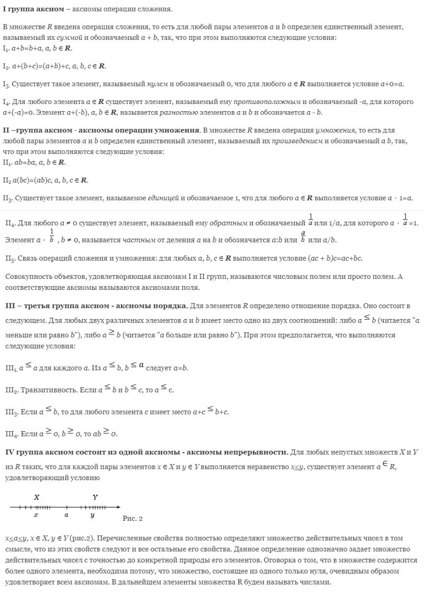

---

### <a name="Вопрос2"> 2. Дайте определение минимума и максимума числового множества. Дайте определение точной нижней и точной верхней граней числового множества.

[Наверх](#начало)

---

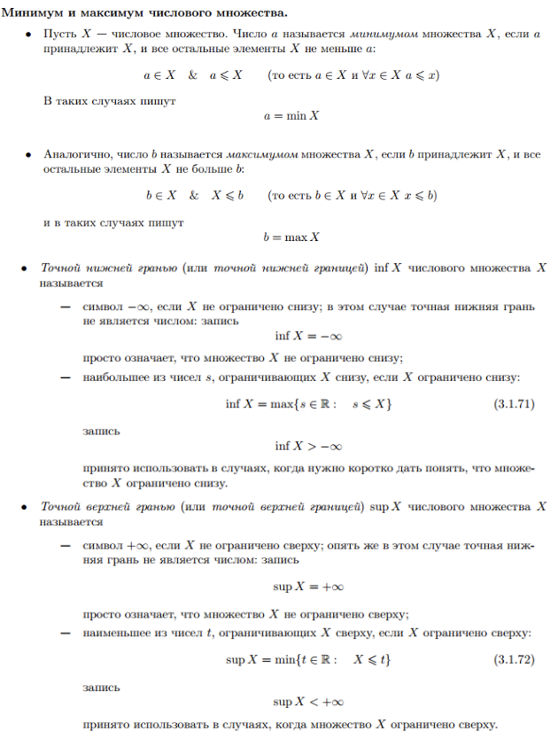

---

### <a name="Вопрос3"> 3. Дайте определение модуля числа. Перечислите его свойства.

[Наверх](#начало)

---

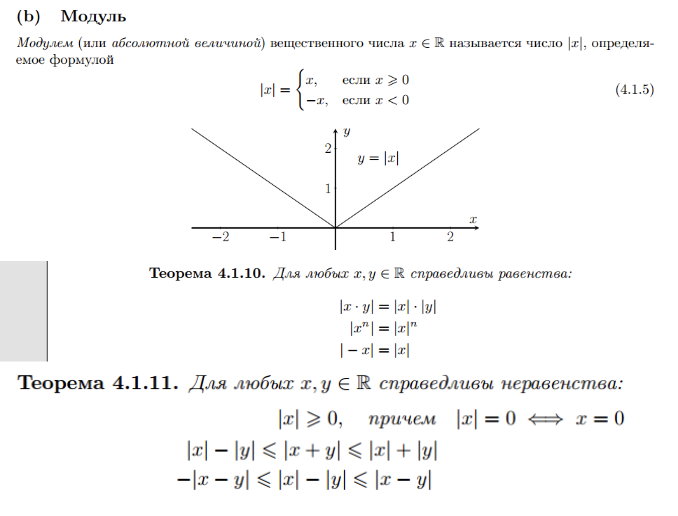

---

### <a name="Вопрос4"> 4. Дайте определение натурального числа. Сформулируйте теорему о доказательствах методом математической индукции.

[Наверх](#начало)

---

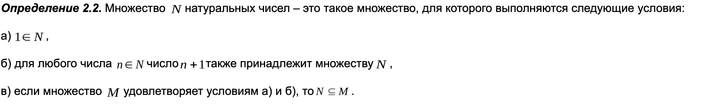

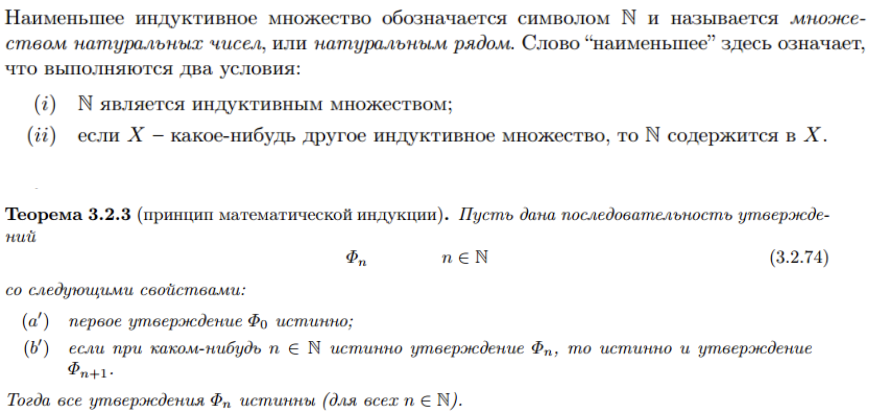

---

### <a name="Вопрос5"> 5. Сформулируйте теорему об определениях методом математической индукции. Приведите примеры определений по индукции.

[Наверх](#начало)

---

---

### <a name="Вопрос6"> 6. Сформулируйте принцип Архимеда. Ограничено ли множество натуральных чисел?

[Наверх](#начало)

---

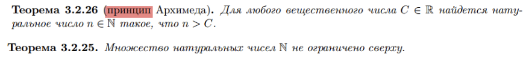

---

### <a name="Вопрос7"> 7. Дайте определение целого и рационального числа. Каким из аксиом вещественных чисел удовлетворяют целые и рациональные числа?

[Наверх](#начало)

---

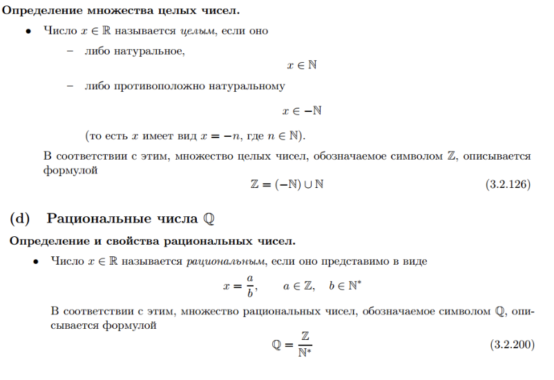

---

### <a name="Вопрос8"> 8. Дайте определение числовой функции. Приведите примеры. Дайте определения функции ограниченной снизу и сверху. Дайте определение точной нижней и точной верхней грани функции на множестве. Дайте определение монотонной функции.

[Наверх](#начало)

---

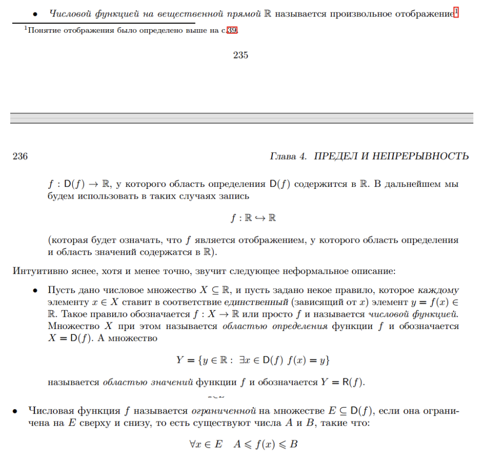

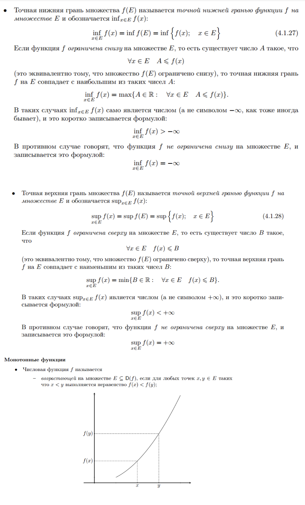

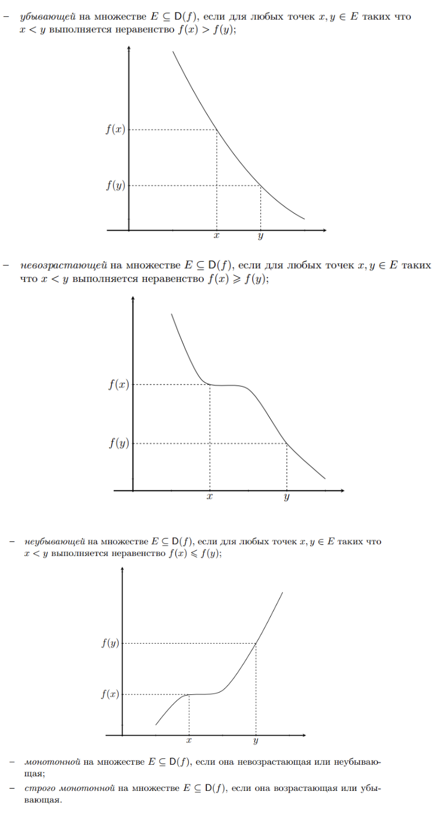

---

### <a name="Вопрос9"> 9. Дайте определение числовой последовательности. Объясните смысл выражения «почти все и». Объясните смысл выражения «почти все элементы последовательности х, лежат в множестве М». Сформулируйте теорему Архимеда.
[Наверх](#начало)

---

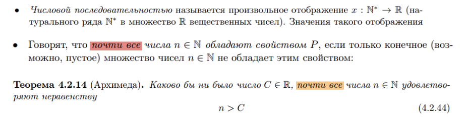

---

### <a name="Вопрос10"> 10. Дайте определение окрестности ${U_z}(а)$ точки $a$ . Дайте определение конечного и бесконечного пределов последовательности. Что такое сходящаяся последовательность? Сформулируйте теорему о единственности предела последовательности.

[Наверх](#начало)

---

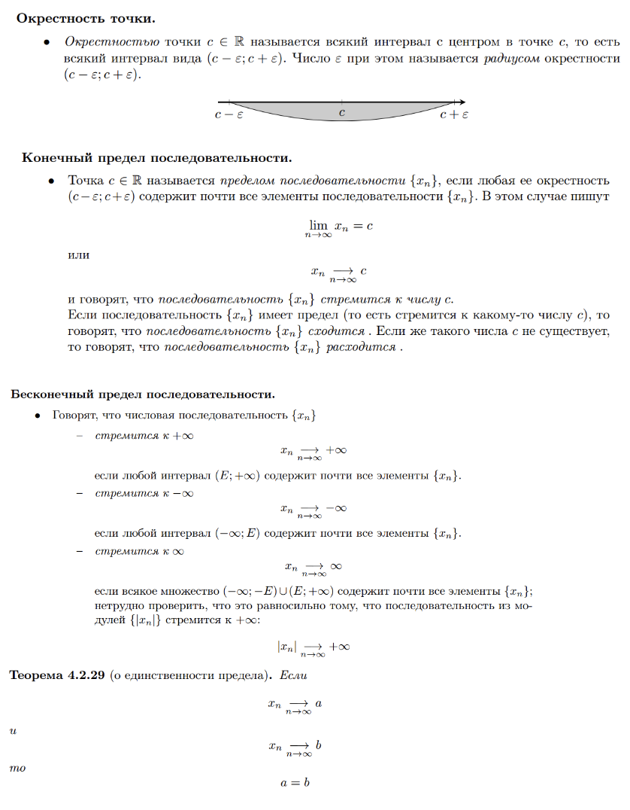

---

###  11.Дайте определение бесконечно малой последовательности. Объясните связь между ними. Сформулируйте критерий сходимости последовательности в терминах существования бесконечно малой последовательности.

[Наверх](#начало)

---

---

###  12.Перечислите арифметические свойства пределов последовательностей.

[Наверх](#начало)

---

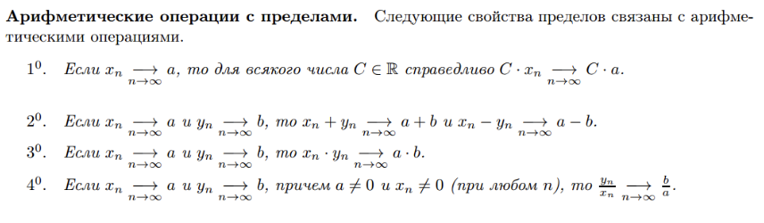

---

###  13.Сформулируйте теорему о предельном переходе в неравенствах. Справедлива ли она для строгих неравенств?

[Наверх](#начало)

---

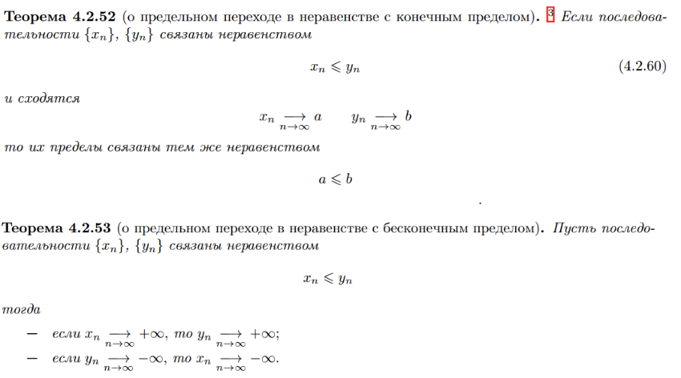

---

###  14. Сформулируйте теорему "о двух милиционерах". Справедлива ли она для строгих неравенств?

[Наверх](#начало)

---

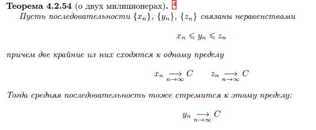

---

###  15. Сформулируйте теорему Вейерштрасса о монотонных последовательностях. Справедлива ли она для строгих неравенств?

[Наверх](#начало)

---

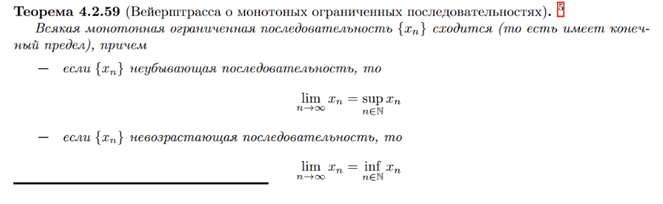

---

###  16. Сформулируйте теорему о вложенных отрезках. Справедлива ли она для открытых интервалов?

[Наверх](#начало)

---

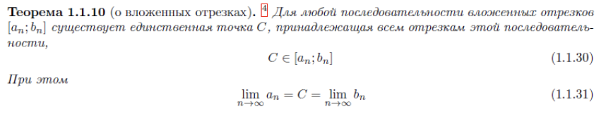

---

###  17. Сформулируйте теорему Больцано-Вейерштрасса.

[Наверх](#начало)

---

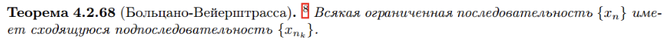

---

###  18. Сформулируйте критерий Коши сходимости последовательности.

[Наверх](#начало)

---

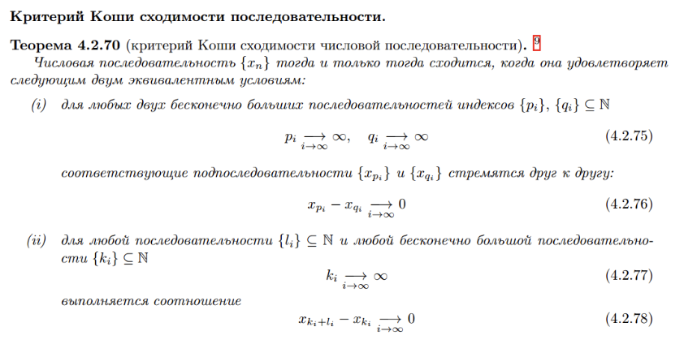

---

###  19. Дайте определение числу Непера $е$.

[Наверх](#начало)

---

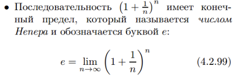

---

###  20. Дайте определение непрерывной функции на множестве. Сформулируйте теорему об арифметических операциях с непрерывными функциями.

[Наверх](#начало)

---

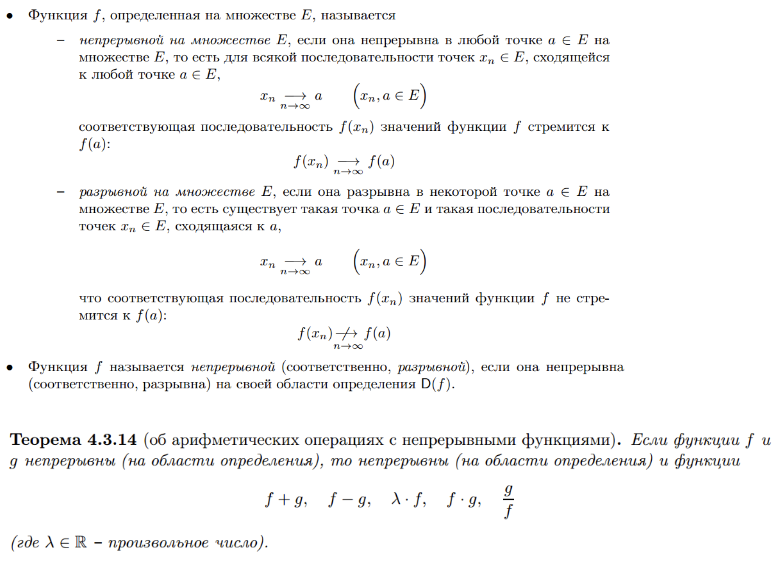

---

###  21. Сформулируйте теорему о композиции непрерывных функций.

[Наверх](#начало)

---

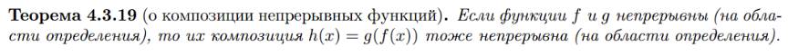

---

###  22. Сформулируйте теорему о сохранении знака непрерывной функцией. 

[Наверх](#начало)

---

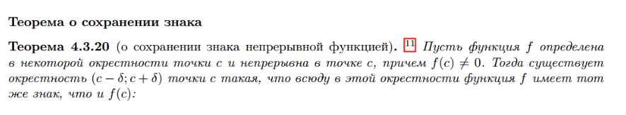

---

###  23. Сформулируйте теорему Коши о промежуточном значении.

[Наверх](#начало)

---

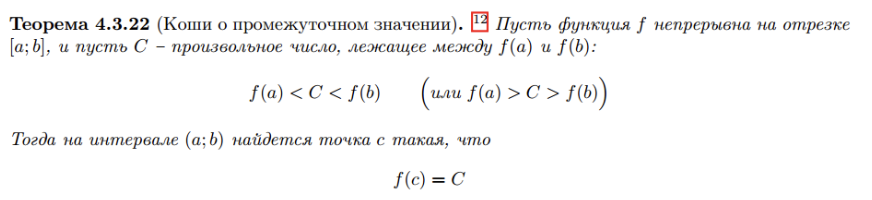

---

###  24. Сформулируйте теорему Вейерштрасса об ограниченности.

[Наверх](#начало)

---

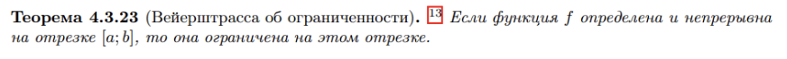

---

###  25. Сформулируйте теорему Вейерштрасса об экстремумах.

[Наверх](#начало)

---

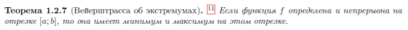

---

###  26. Дайте определение равномерно непрерывной функции на множестве. Приведите примеры. Сформулируйте теорему Кантора о равномерной непрерывности.

[Наверх](#начало)

---

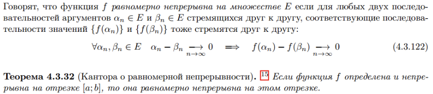

---

###  27. Дайте определение предела функции по Гейне. Приведите примеры.

[Наверх](#начало)

---

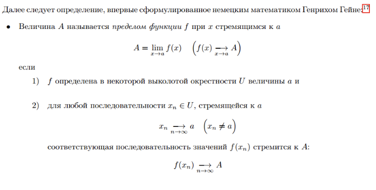

---

###  28. Сформулируйте теорему о пределе непрерывной функции.

[Наверх](#начало)

---

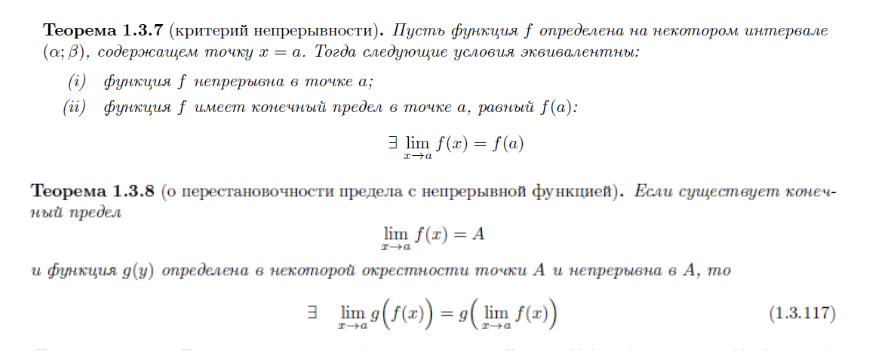

---

###  29. Сформулируйте теорему о замене переменной под знаком предела.

[Наверх](#начало)

---

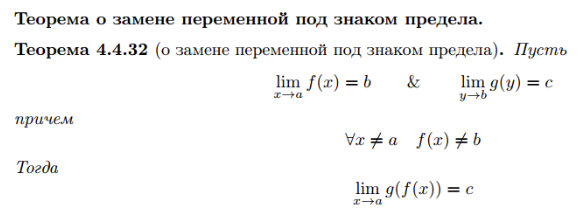

---

###  30. Перечислите арифметические свойства предела функции.

[Наверх](#начало)

---

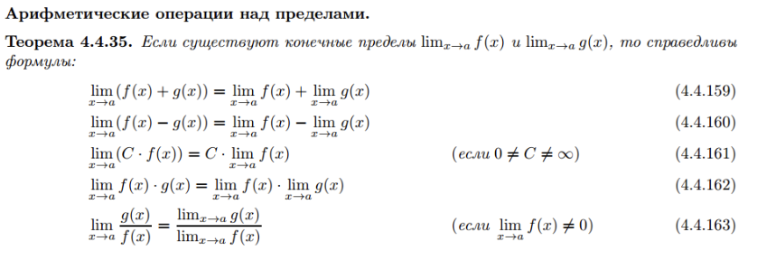

---
