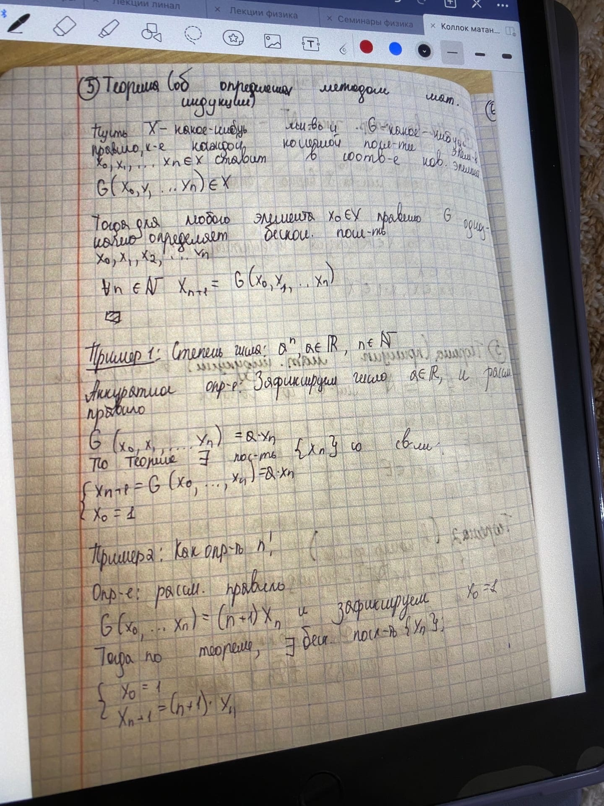

# Ответы к колоквиуму по курсу "Математический анализ"

## <a name="начало"> Навигация по странице

- **[*1* Опишите аксиомы теории вещественных чисел. Какие из известных вам числовых множеств удовлетворяют этим аксиомам?](#Вопрос-1)**   

- **[*2* Дайте определение минимума и максимума числового множества. Дайте определение точной нижней и точной верхней граней числового множества. Сформулируйте и докажите теорему о точной границе.](#Вопрос-2)**  

- **[*3* Дайте определение натурального числа. Сформулируйте и докажите теорему о доказательствах методом математической индукции. ](#Вопрос-3)**  

- **[*4* Сформулируйте теорему об определениях методом математической индукции. Приведите примеры определений по индукции. ](#Вопрос-4)**  

- **[*5* Сформулируйте и докажите теорему о неограниченности множества натуральных чисел. Сформулируйте и докажите принцип Архимеда.](#Вопрос-5)**  

- **[*6* Дайте определение числовой последовательности. Объясните смысл выражения «почти все n». Объясните смысл выражения «почти все элементы последовательности xn лежат в множестве M». Сформулируйте и докажите теорему Архимеда.](#Вопрос-6)**  

- **[*7* Дайте определение окрестности Uε(a) точки a. Дайте определение конечного и бесконечного пределов последовательности. Что такое сходящаяся последовательность? Сформулируйте и докажите теорему о единственности предела последовательности. ](#Вопрос-7)**  

- **[*8* Дайте определение бесконечно малой и бесконечно большой последовательности. Объясните связь между ними. Сформулируйте и докажите критерий сходимости последовательности в терминах существования бесконечно малой последовательности.](#Вопрос-8)**  

- **[*9* Перечислите арифметические свойства пределов последовательностей. Докажите какое-нибудь из них.](#Вопрос-9)**  

- **[*10* Сформулируйте и докажите теорему о предельном переходе в неравенствах. Справедлива ли она для строгих неравенств? ](#Вопрос-10)**  

- **[*11* Сформулируйте и докажите теорему "о двух милиционерах". Справедлива ли она для строгих неравенств?](#Вопрос-11)**  

- **[*12* Сформулируйте и докажите теорему Вейерштрасса о монотонных последовательностях. Справедлива ли она для строгих неравенств?](#Вопрос-12)** 

- **[*13* Сформулируйте и докажите теорему о вложенных отрезках. Справедлива ли она для открытых интервалов?](#Вопрос-13)**  

- **[*14* Сформулируйте теорему Больцано-Вейерштрасса. Сформулируйте критерий Коши сходимости последовательности. Дайте определение числу Непера e. ](#Вопрос-14)**  

- **[*15* Дайте определение непрерывной функции на множестве. Сформулируйте и докажите теорему об арифметических операциях с непрерывными функциями. ](#Вопрос-15)**  

- **[*16* Сформулируйте и докажите теорему о композиции непрерывных функций.](#Вопрос-16)**  

- **[*17* Сформулируйте и докажите теорему о сохранении знака непрерывной функцией.](#Вопрос-17)**  

- **[*18* Сформулируйте и докажите теорему Коши о промежуточном значении.](#Вопрос-18)**  

- **[*19* Сформулируйте и докажите теорему Вейерштрасса об ограниченности.](#Вопрос-19)**  

- **[*20* Сформулируйте и докажите теорему Вейерштрасса об экстремумах.](#Вопрос-20)**  

- **[*21* Дайте определение равномерно непрерывной функции на множестве. Приведите примеры. Сформулируйте теорему Кантора о равномерной непрерывности.](#Вопрос-21)**  

- **[*22* Дайте определение предела функции по Гейне. Сформулируйте и докажите теорему о пределе непрерывной функции.](#Вопрос-22)**  

- **[*23* Сформулируйте и докажите теорему о замене переменной под знаком предела.](#Вопрос-23)**  

- **[*24* Перечислите арифметические свойства предела функции. Докажите какое-нибудь из них](#Вопрос-24)**  

- **[*25* Дайте определение производной. Перечислите формулы для производных элементарных функций. Докажите какую-нибудь из них.](#Вопрос-25)**  

- **[*26*Сформулируйте арифметические правила вычисления производных и докажите какое-нибудь из них.](#Вопрос-26)**  

- **[*27* Сформулируйте и докажите теорему о производной композиции.](#Вопрос-27)**  

- **[*28* Сформулируйте и докажите теорему Ферма.](#Вопрос-28)**  

- **[*29* Сформулируйте и докажите теорему Ролля.](#Вопрос-29)**  

- **[*30* Сформулируйте и докажите теорему Лагранжа](#Вопрос-30)**  

- **[*31* Сформулируйте и докажите теорему Коши.](#Вопрос-31)**  

- **[*32* Сформулируйте и докажите правило Лопиталя для неопределенностей вида $\frac{0}{0}$. Сформулируйте правило Лопиталя для неопределенностей вида $\frac{\infty}{\infty}$](#Вопрос-32)**  

- **[*33* Сформулируйте и докажите достаточное условие монотонности.](#Вопрос-33)**  

- **[*34* Сформулируйте и докажите необходимое условие локального экстремума. Сформулируйте и докажите достаточное условие локального экстремума.](#Вопрос-34)**  

- **[*35* Дайте определение выпуклой функции на интервале. Сформулируйте достаточное условие выпуклости](#Вопрос-35)**  

- **[*36* Дайте определение точки перегиба. Сформулируйте и докажите теорему о точках перегиба.](#Вопрос-36)**  

- **[*37* Дайте определение вертикальной и наклонной асимптот. Приведите и докажите формулы для вычисления коэффициентов наклонной асимптоты.](#Вопрос-37)**  

- **[*38* Дайте определение асимптотической эквивалентности. Приведите формулы асимптотической эквивалентности для элементарных функций. Докажите две из них. Опишите свойства асимптотической эквивалентности.](#Вопрос-38)**  

- **[*39* Дайте определение асимптотического сравнения. Приведите формулы асимптотического сравнения для элементарных функций. Докажите две из них. Опишите свойства асимптотического сравнения.](#Вопрос-39)**  

- **[*40* Сформулируйте и докажите теорему о шкале бесконечностей. ](#Вопрос-40)**  

- **[*41* Сформулируйте и докажите теорему Тейлора-Пеано.](#Вопрос-41)**  

---

## Вопрос 1

### <a name="Вопрос1"> 1. Опишите аксиомы теории вещественных чисел. Какие из известных вам числовых множеств удовлетворяют этим аксномам?

[Наверх](#начало)

---

A1. Коммутативность сложения: $a + b = b + a$

A2. Ассоциативность сложения: $(a + b) + c = a + (b + c)$

A3. Коммутативность умножения: $a \cdot b = b \cdot a$

A4. Ассоциативность умножения: $(a \cdot b) \cdot c = a \cdot (b \cdot c)$

A5. Дистрибутивность: $a \cdot (b + c) = a \cdot b + a \cdot c$

A6. Существование нуля: $\exists 0 \in \mathbb{R}$, такое что $a + 0 = a$

A7. Существоание противоположного: $\exists -a \in \mathbb{R}$, такое что $a + (-a) = 0$

A8. Существование единицы: $\exists 1 \in \mathbb{R}$, такое что $a \cdot 1 = a$

A9. Существование обратного: $\exists a^{-1} \in \mathbb{R}$, такое что $a \cdot a^{-1} = 1$

### Сравнение вещественных чисел

A10. Рефлективность: Для любого числа справдливо $a \leq a$

A11. Транзитивность: Для любых чисел $a, b, c$ справдливо $a \leq b$ и $b \leq c$ $\Rightarrow$ $a \leq c$

A12. Антисимметричность: Для любых чисел $a, b$ справдливо $a \leq b$ и $b \leq a$ $\Rightarrow$ $a = b$

A13. Линейность: Для любых чисел $a, b, c, d$ справдливо $a \leq b$ и $c \leq d$ $\Rightarrow$ $ac \leq bd$

A14. Монотонность сложения (по правому аргументу): Для любых чисел $a, b, c$ справдливо $a \leq b$ $\Rightarrow$ $a + c \leq b + c$

A15. Сохранение знака + при умножениии: Для любых чисел $a, b, c, d$ справдливо $a \leq b$ и $c \leq d$ $\Rightarrow$ $ac \leq bd$

A16. Непрерывность вещественной прямой: Для любых чисел $a, b$ справдливо $a \leq b$ $\Rightarrow$ существует $x \in (a, b)$, такой что $x \leq a$ и $x \leq b$

---

## Вопрос 2

### <a name="Вопрос2"> 2. Дайте определение минимума и максимума числового множества. Дайте определение точной нижней и точной верхней граней числового множества.

[Наверх](#начало)

---

Пусть $X$ - числовое множество. Число $a$ называется минимумом $X$, если $a$ - наименьшее число из $X$. Число $a$ называется максимумом $X$, если $b$ - наибольшее число из $X$.
В таких случаях пишут: 

$$\min X = a$$

$$\max X = b$$

Точной нижней гранью (или точной нижней границей) $\inf X$ числового множества $X$
называется
- символ $-\infty$, если $X$ не ограничено снизу
- наибольшее из чисел s, ограничивающих X снизу, если X ограничено снизу: $\inf X = \max$ { $s \in R : s \leq X$ }
 
Аналогично, точной верхней гранью (или точной верхней границей) $\sup X$ числового множества $X$
называется
- символ $+\infty$, если $X$ не ограничено сверху
- наименьшее из чисел $t$, ограничивающих $X$ сверху, если $X$ ограничено сверху: $\sup X = \min$ { $t \in R : X \leq t$ }

---

## Вопрос 3

### <a name="Вопрос3"> 3. Дайте определение модуля числа. Перечислите его свойства.

[Наверх](#начало)

---

---

## Вопрос 4

### <a name="Вопрос4"> 4. Дайте определение натурального числа. Сформулируйте теорему о доказательствах методом математической индукции.

[Наверх](#начало)

---

---

## Вопрос 5

### <a name="Вопрос5"> 5. Сформулируйте теорему об определениях методом математической индукции. Приведите примеры определений по индукции.

[Наверх](#начало)

---

---

## Вопрос 6

### <a name="Вопрос6"> 6. Сформулируйте принцип Архимеда. Ограничено ли множество натуральных чисел?

[Наверх](#начало)

---

---

## Вопрос 7

### <a name="Вопрос7"> 7. Дайте определение целого и рационального числа. Каким из аксиом вещественных чисел удовлетворяют целые и рациональные числа?

[Наверх](#начало)

---

---

## Вопрос 8

### <a name="Вопрос8"> 8. Дайте определение числовой функции. Приведите примеры. Дайте определения функции ограниченной снизу и сверху. Дайте определение точной нижней и точной верхней грани функции на множестве. Дайте определение монотонной функции.

[Наверх](#начало)

---

---

## Вопрос 9

### <a name="Вопрос9"> 9. Дайте определение числовой последовательности. Объясните смысл выражения «почти все и». Объясните смысл выражения «почти все элементы последовательности х, лежат в множестве М». Сформулируйте теорему Архимеда.
[Наверх](#начало)

---

---

## Вопрос 10

### <a name="Вопрос10"> 10. Дайте определение окрестности $U_z{(a)}$ точки $a$ . Дайте определение конечного и бесконечного пределов последовательности. Что такое сходящаяся последовательность? Сформулируйте теорему о единственности предела последовательности.

[Наверх](#начало)

---

---

## Вопрос 11

###  11.Дайте определение бесконечно малой последовательности. Объясните связь между ними. Сформулируйте критерий сходимости последовательности в терминах существования бесконечно малой последовательности.

[Наверх](#начало)

---

---

## Вопрос 12

###  12.Перечислите арифметические свойства пределов последовательностей.

[Наверх](#начало)

---

---

## Вопрос 13

###  13.Сформулируйте теорему о предельном переходе в неравенствах. Справедлива ли она для строгих неравенств?

[Наверх](#начало)

---

---

## Вопрос 14

###  14. Сформулируйте теорему "о двух милиционерах". Справедлива ли она для строгих неравенств?

[Наверх](#начало)

---

---

## Вопрос 15

###  15. Сформулируйте теорему Вейерштрасса о монотонных последовательностях. Справедлива ли она для строгих неравенств?

[Наверх](#начало)

---

---

## Вопрос 16

###  16. Сформулируйте теорему о вложенных отрезках. Справедлива ли она для открытых интервалов?

[Наверх](#начало)

---

---

## Вопрос 17

###  17. Сформулируйте теорему Больцано-Вейерштрасса.

[Наверх](#начало)

---

---

## Вопрос 18

###  18. Сформулируйте критерий Коши сходимости последовательности.

[Наверх](#начало)

---

---

## Вопрос 19

###  19. Дайте определение числу Непера $е$.

[Наверх](#начало)

---

---

## Вопрос 20

###  20. Дайте определение непрерывной функции на множестве. Сформулируйте теорему об арифметических операциях с непрерывными функциями.

[Наверх](#начало)

---

---

## Вопрос 21

###  21. Сформулируйте теорему о композиции непрерывных функций.

[Наверх](#начало)

---

---

## Вопрос 22

###  22. Сформулируйте теорему о сохранении знака непрерывной функцией. 

[Наверх](#начало)

---

---

## Вопрос 23

###  23. Сформулируйте теорему Коши о промежуточном значении.

[Наверх](#начало)

---

---

## Вопрос 24

###  24. Сформулируйте теорему Вейерштрасса об ограниченности.

[Наверх](#начало)

---

---

## Вопрос 25

###  25. Сформулируйте теорему Вейерштрасса об экстремумах.

[Наверх](#начало)

---

---

## Вопрос 26

###  26. Дайте определение равномерно непрерывной функции на множестве. Приведите примеры. Сформулируйте теорему Кантора о равномерной непрерывности.

[Наверх](#начало)

---

---

## Вопрос 27

###  27. Дайте определение предела функции по Гейне. Приведите примеры.

[Наверх](#начало)

---

---

## Вопрос 28

###  28. Сформулируйте теорему о пределе непрерывной функции.

[Наверх](#начало)

---

---

## Вопрос 29

###  29. Сформулируйте теорему о замене переменной под знаком предела.

[Наверх](#начало)

---

---

## Вопрос 30

###  30. Перечислите арифметические свойства предела функции.

[Наверх](#начало)

---

---
