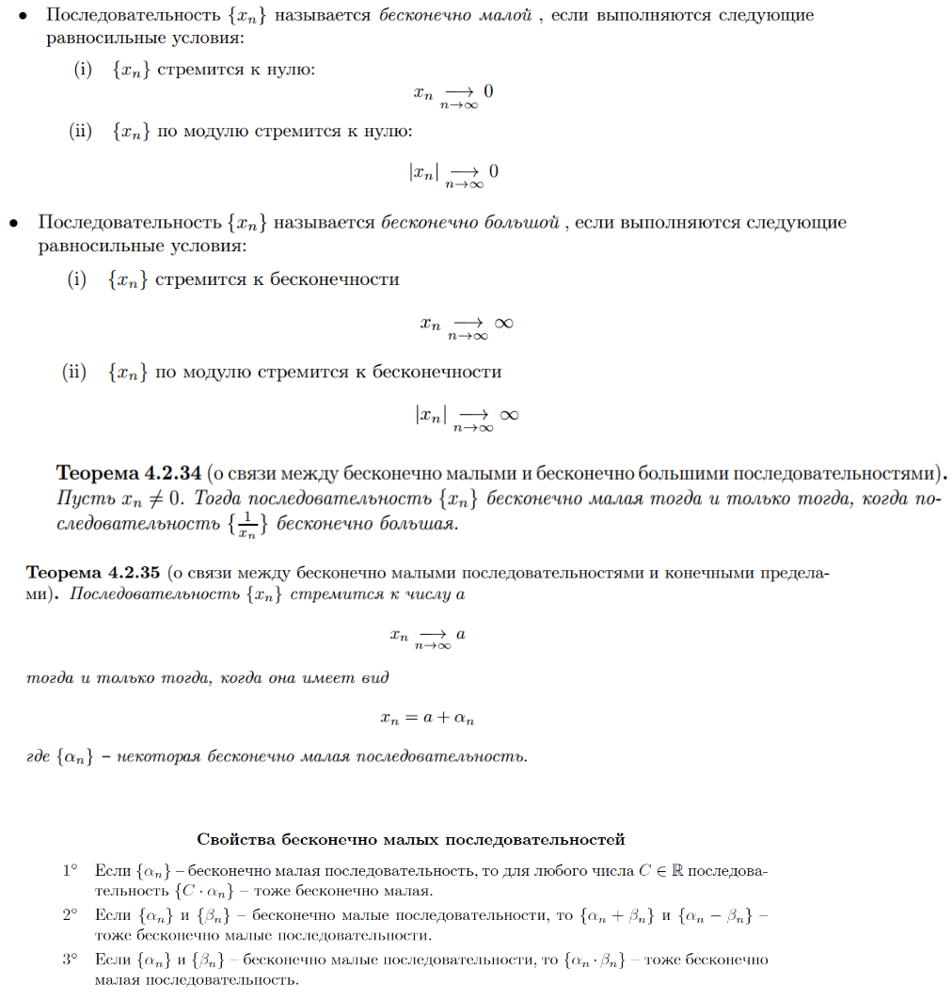

# Ответы к колоквиуму по курсу "Математический анализ"

## <a name="начало"> Навигация по странице:

 + [*1* Первый вопрос](#Parag1);
 + [*2* Второй вопрос](#Parag2);
 + [*3* Третий вопрос](#Parag3);
 + [*4* Четвертый вопрос](#Parag4);
 + [*5* Пятый вопрос](#Parag5);
 + [*6* Шестой вопрос](#Parag6);
 + [*7* Седьмой вопрос](#Parag7);
 + [*8* Восьмой вопрос](#Parag8);
 + [*9* Девятый вопрос](#Parag9);
 + [*10* Десятый вопрос](#Parag10);
 + [*11* Одиннадцатый вопрос](#Parag11);
 + [*12* Двенадцатый вопрос](#Parag12);
 + [*13* Тринадцатый вопрос](#Parag13);
 + [*14* Четырнадцатый вопрос](#Parag14);
 + [*15* Пятнадцатый вопрос](#Parag15);
 + [*16* Шестнадцатый вопрос](#Parag16);
 + [*17* Семнадцатый вопрос](#Parag17);
 + [*18* Восемнадцатый вопрос](#Parag18);
 + [*19* Девятнадцатый вопрос](#Parag19);
 + [*20* Двадцатый вопрос](#Parag20);
 + [*21* Двадцать первый вопрос](#Parag21);
 + [*22* Двадцать второй вопрос](#Parag22);
 + [*23* Двадцать третий вопрос](#Parag23);
 + [*24* Двадцать четвертый вопрос](#Parag24);
 + [*25* Двадцать пятый вопрос](#Parag25);
 + [*26* Двадцать шестой вопрос](#Parag26);
 + [*27* Двадцать седьмой вопрос](#Parag27);
 + [*28* Двадцать восьмой вопрос](#Parag28);
 + [*29* Двадцать девятый вопрос](#Parag29);
 + [*30* Тридцатый вопрос](#Parag30);

---

### <a name="Parag1"> 1. Опишите аксиомы теории вещественных чисел. Какие из известных вам числовых множеств удовлетворяют этим аксномам?

[Наверх](#начало)

---

---

### <a name="Parag2"> 2. Дайте определение минимума и максимума числового множества. Дайте определение точной нижней и точной верхней граней числового множества.

[Наверх](#начало)

---

---

### <a name="Parag3"> 3. Дайте определение модуля числа. Перечислите его свойства.

[Наверх](#начало)

---

---

### <a name="Parag4"> 4. Дайте определение натурального числа. Сформулируйте теорему о доказательствах методом математической индукции.

[Наверх](#начало)

---

---

### <a name="Parag5"> 5. Сформулируйте теорему об определениях методом математической индукции. Приведите примеры определений по индукции.

[Наверх](#начало)

---

---

### <a name="Parag6"> 6. Сформулируйте принцип Архимеда. Ограничено ли множество натуральных чисел?

[Наверх](#начало)

---

---

### <a name="Parag7"> 7. Дайте определение целого и рационального числа. Каким из аксиом вещественных чисел удовлетворяют целые и рациональные числа?

[Наверх](#начало)

---

---

### <a name="Parag8"> 8. Дайте определение числовой функции. Приведите примеры. Дайте определения функции ограниченной снизу и сверху. Дайте определение точной нижней и точной верхней грани функции на множестве. Дайте определение монотонной функции.

[Наверх](#начало)

---

---

### <a name="Parag9"> 9. Дайте определение числовой последовательности. Объясните смысл выражения «почти все и». Объясните смысл выражения «почти все элементы последовательности х, лежат в множестве М». Сформулируйте теорему Архимеда.
[Наверх](#начало)

---

---

### <a name="Parag10"> 10. Дайте определение окрестности $U_z(а)$ точки $a$. Дайте определение конечного и бесконечного пределов последовательности. Что такое сходящаяся последовательность? Сформулируйте теорему о единственности предела последовательности.

[Наверх](#начало)

---

---

###  11.Дайте определение бесконечно малой последовательности. Объясните связь между ними. Сформулируйте критерий сходимости последовательности в терминах существования бесконечно малой последовательности.

[Наверх](#начало)

---

---

###  12.Перечислите арифметические свойства пределов последовательностей.

[Наверх](#начало)

---

---

###  13.Сформулируйте теорему о предельном переходе в неравенствах. Справедлива ли она для строгих неравенств?

[Наверх](#начало)

---

---

###  14. Сформулируйте теорему "о двух милиционерах". Справедлива ли она для строгих неравенств?

[Наверх](#начало)

---

---

###  15. Сформулируйте теорему Вейерштрасса о монотонных последовательностях. Справедлива ли она для строгих неравенств?

[Наверх](#начало)

---

---

###  16. Сформулируйте теорему о вложенных отрезках. Справедлива ли она для открытых интервалов?

[Наверх](#начало)

---

---

###  17. Сформулируйте теорему Больцано-Вейерштрасса.

[Наверх](#начало)

---

---

###  18. Сформулируйте критерий Коши сходимости последовательности.

[Наверх](#начало)

---

---

###  19. Дайте определение числу Непера $е$.

[Наверх](#начало)

---

---

###  20. Дайте определение непрерывной функции на множестве. Сформулируйте теорему об арифметических операциях с непрерывными функциями.

[Наверх](#начало)

---

---

###  21. Сформулируйте теорему о композиции непрерывных функций.

[Наверх](#начало)

---

---

###  22. Сформулируйте теорему о сохранении знака непрерывной функцией. 

[Наверх](#начало)

---

---

###  23. Сформулируйте теорему Коши о промежуточном значении.

[Наверх](#начало)

---

---

###  24. Сформулируйте теорему Вейерштрасса об ограниченности.

[Наверх](#начало)

---

---

###  25. Сформулируйте теорему Вейерштрасса об экстремумах.

[Наверх](#начало)

---

---

###  26. Дайте определение равномерно непрерывной функции на множестве. Приведите примеры. Сформулируйте теорему Кантора о равномерной непрерывности.

[Наверх](#начало)

---

---

###  27. Дайте определение предела функции по Гейне. Приведите примеры.

[Наверх](#начало)

---

---

###  28. Сформулируйте теорему о пределе непрерывной функции.

[Наверх](#начало)

---

---

###  29. Сформулируйте теорему о замене переменной под знаком предела.

[Наверх](#начало)

---

---

###  30. Перечислите арифметические свойства предела функции.

[Наверх](#начало)

---

---